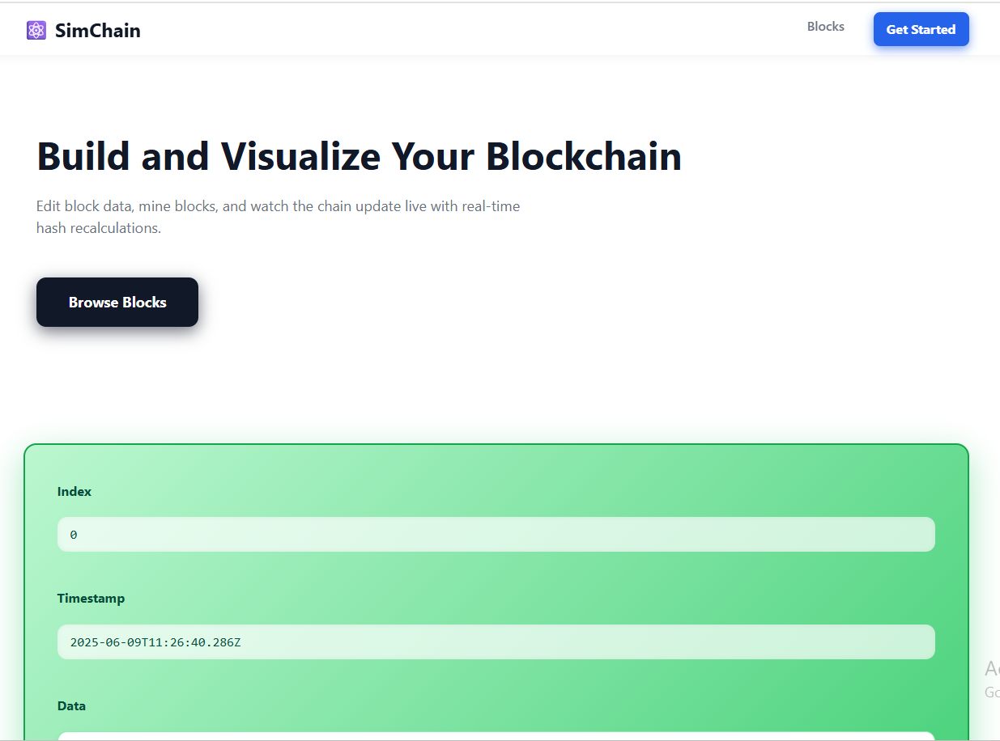
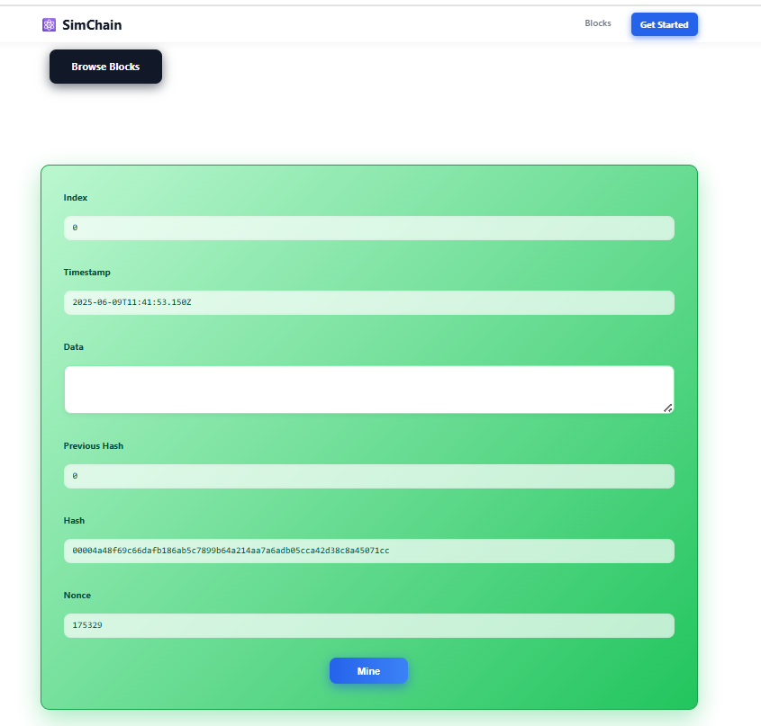
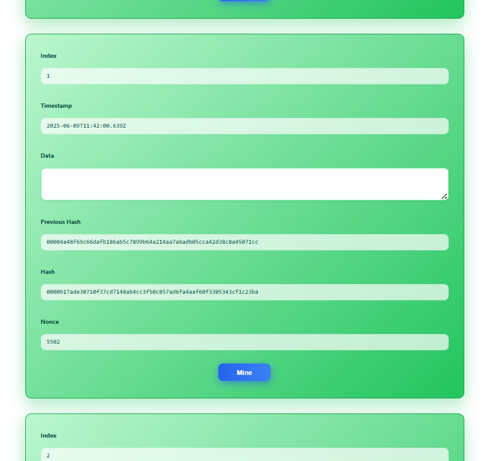
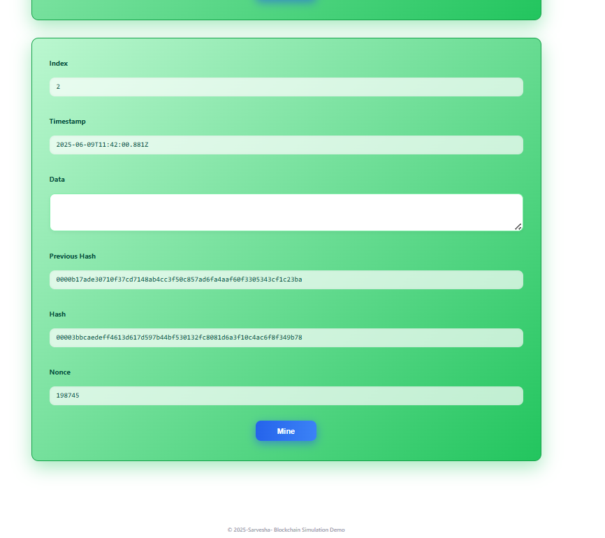
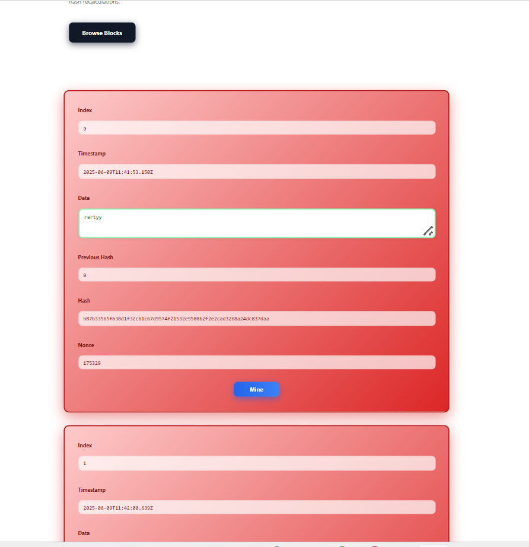
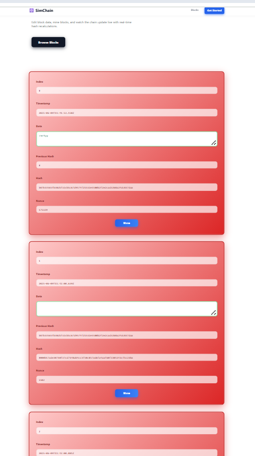
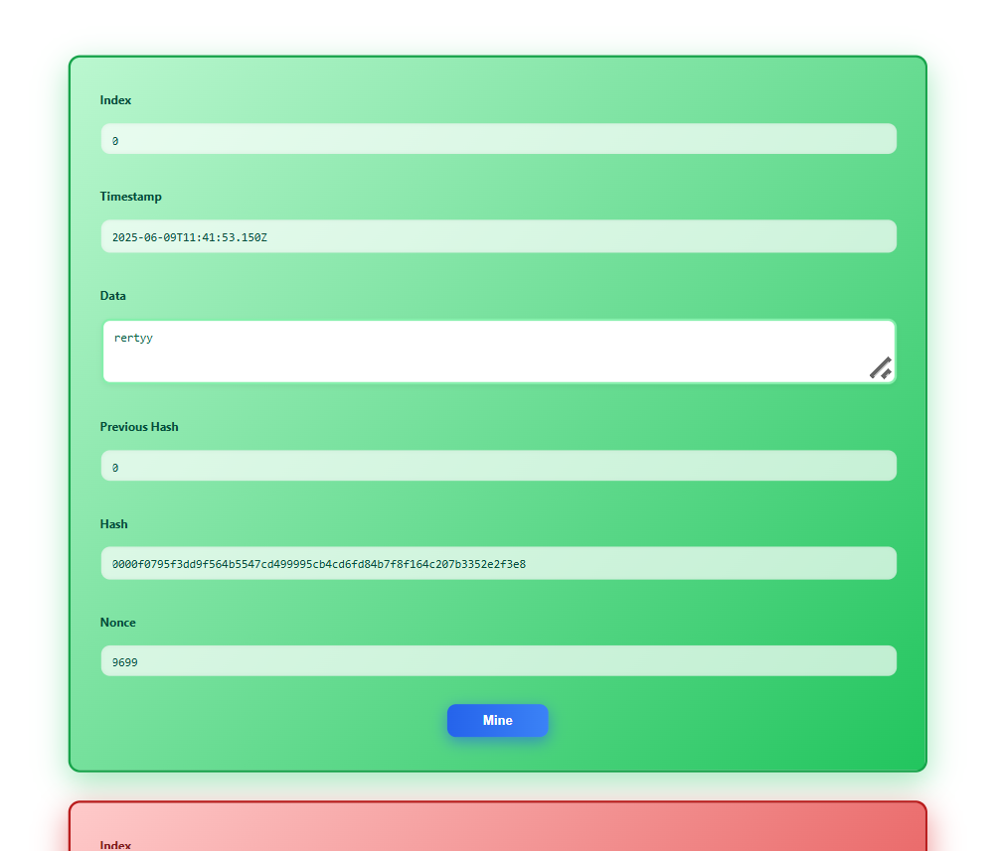

# Output Documentation for Blockchain Simulator

## Overview

This document provides an overview and visual demonstration of the Blockchain Simulator—a clean and elegant interactive tool built to help users understand blockchain concepts. The simulator allows users to create, edit, and mine blocks, dynamically updating hashes and illustrating blockchain validity.

---

## User Interface Overview

The interface is carefully designed following modern minimalist principles, featuring:

- A light background (#ffffff) with ample whitespace for breathing room.
- Bold, large typography for clear hierarchy and legibility.
- Subtle rounded card containers with soft shadows for block elements.
- Responsive layout centered within a max-width container.
- Interactive controls such as editable data fields and mine buttons with smooth hover states.
- Clear visual feedback showing valid (green) and invalid (red) blocks dynamically.

---

## Key Features Demonstrated

- **Real-Time Hash Recalculation:** Editing block data changes the hash instantly.
- **Mining Blocks:** Mining adjusts the nonce until the hash satisfies difficulty requirements.
- **Chain Integrity:** Tampering with one block causes cascading invalidation of subsequent blocks.
- **Visual Feedback:** Valid blocks are highlighted with a gradient green card, invalid blocks with red.
- **Responsive and Accessible UI:** Structured with semantic HTML and accessible attributes.

---

## Screenshots

### Hero Section

The hero section features a bold, single-line headline with a concise subtitle and a prominent call-to-action button inviting exploration._

---

### Blockchain Display with All Valid Blocks

---

### Editing Data in a Block

Upon editing the data of a block, its hash updates immediately, the block turns red indicating invalidity, and subsequent blocks also turn red due to broken chain linkage.

---

### Mining a Block

Demonstrates the mining operation with a loading state. Upon successful mining, the block is validated (green) and nonce updated accordingly. Downstream blocks are invalidated and require re-mining.

---

## Conclusion

The Blockchain Simulator provides an intuitive and visually rich experience, clearly demonstrating how block data and mining affect blockchain integrity. With clear, elegant design and responsive UI, it serves both educational and demonstrational purposes effectively.

---
