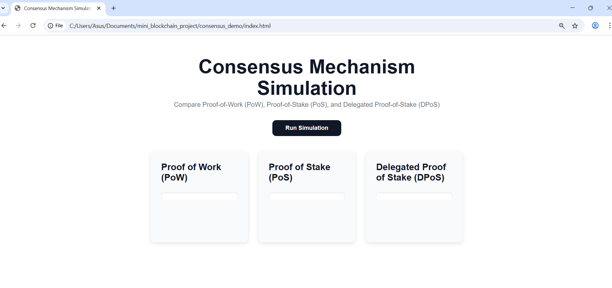

# Consensus Mechanism Simulator

 This interactive simulator compares three popular blockchain consensus algorithms:

- **Proof of Work (PoW)**
- **Proof of Stake (PoS)**
- **Delegated Proof of Stake (DPoS)**

It helps us understand how various blockchain networks select validators to confirm transactions and add blocks to the chain using different principles.

---

## Features

- **Mock Validators:** Each consensus algorithm uses a set of mock validators with randomized attributes appropriate for the mechanism:
  - PoW miners have computational power.
  - PoS stakers have stakes.
  - DPoS delegates receive votes.
- **Selection Simulation:** 
  - PoW chooses the miner with the highest power.
  - PoS selects the validator with the highest stake.
  - DPoS randomly selects a delegate weighted by the number of votes.
- **Clear Output:** The selected validator for each consensus method is highlighted along with a textual explanation of how selection works.
- **Console Logs:** Detailed logs explain the internal decision-making process for transparency.

---

## Installation & Usage

1. Clone or download the project files.
2. Open the file `consensus-simulation.html` in a modern web browser.
3. Click the **Run Simulation** button to generate new sets of mock validators and simulate the selection for all three methods.

---

## User Interface Overview

The interface is designed for clarity and modern aesthetics, following these principles:

- Large bold header with descriptive subtitle.
- Cards for each consensus algorithm arranged in a responsive grid.
- Validator lists shown with their respective powers/stakes/votes.
- Selected validator prominently shown with a detailed explanation.
- Gentle hover effects on the button and subtle shadows on cards.
- Light background (#ffffff) with plenty of whitespace.
- Elegant typography with neutral gray text (#6b7280) for explanations.
- Mobile responsive and accessible.

---

## Screenshots

### Full Simulator View

*The main UI showing all three consensus cards side by side with validator lists and selected validators.*

### Run Simulation

### Example output for PoW: miner with highest computational power is selected.
### Example output for PoS: validator with highest stake selected.
### Example output for DPoS: delegate selected based on votes weighted random selection.
---

## Technical Details

- Written using semantic HTML5 and vanilla JavaScript.
- Styled with modern CSS using variables for a clean, consistent appearance.
- Randomized mock data for realistic simulation scenarios.
- Accessible ARIA roles and labels included for screen readers.
- Console logs provide developer insight into each selection step.

---

## Future Enhancements

- Add more validators dynamically.
- Enable user input to customize stake, power, or votes.
- Add animations or visual charts to demonstrate consensus process dynamically.
- Implement other consensus mechanisms like Practical Byzantine Fault Tolerance (PBFT).

