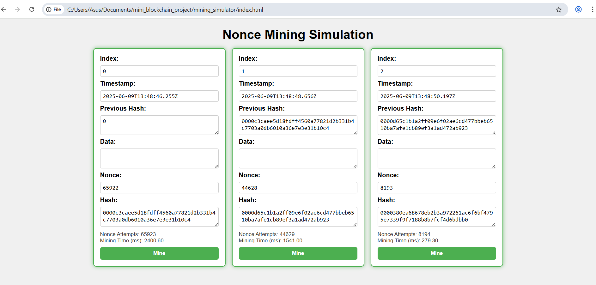
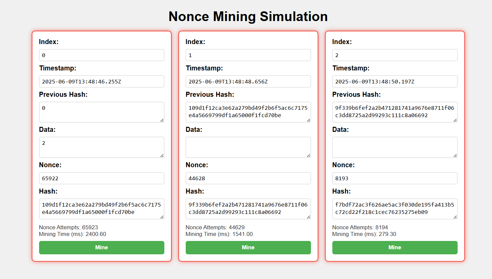
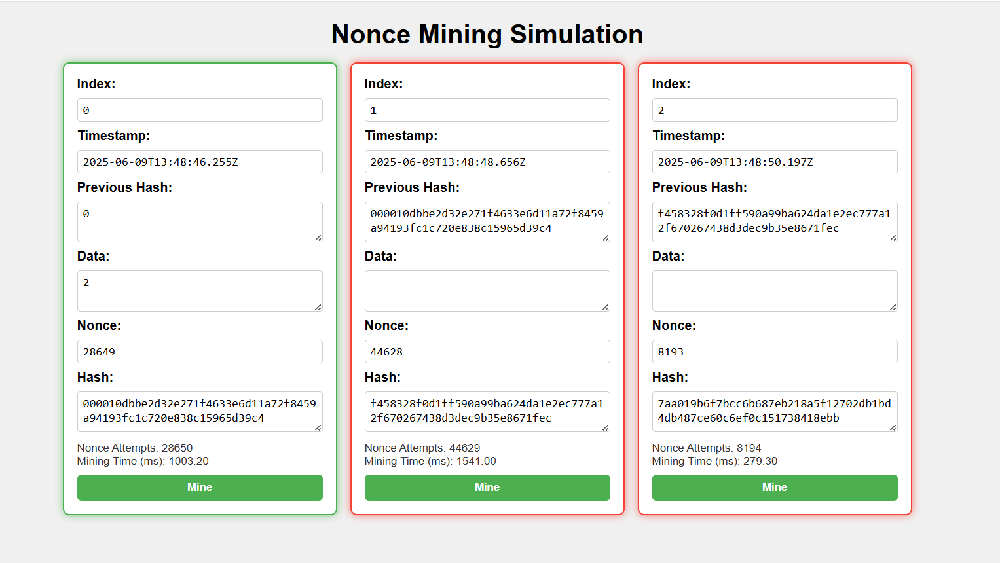
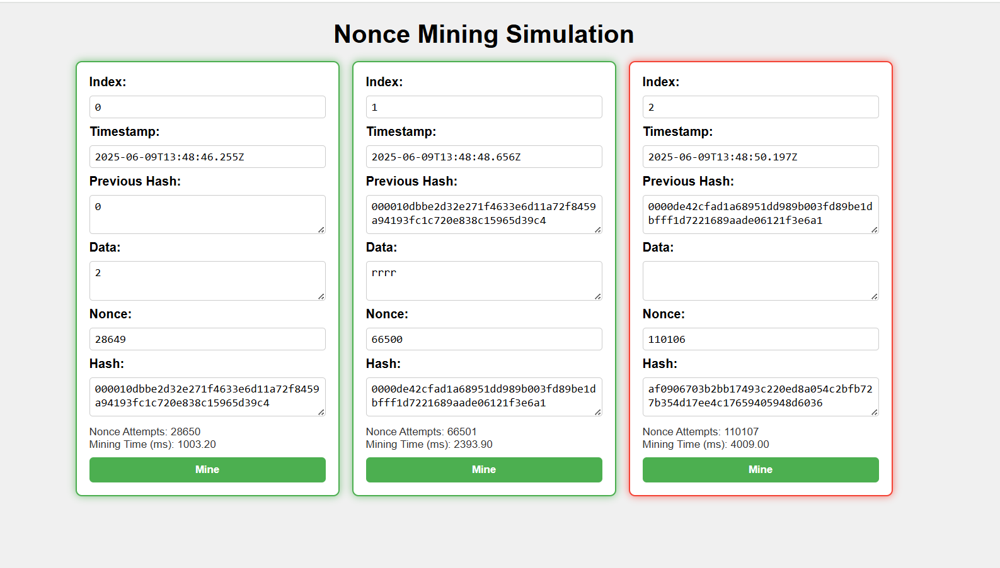
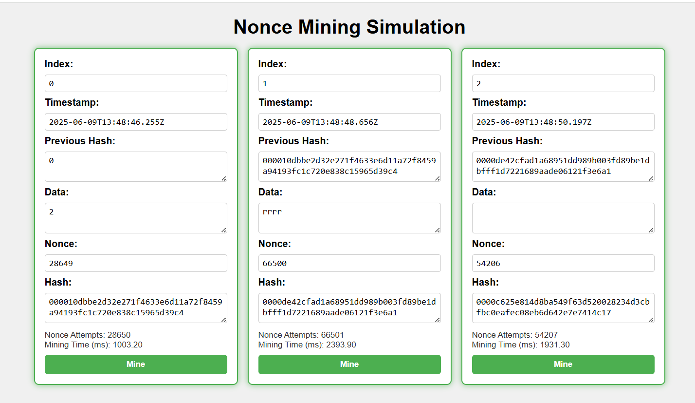

# 🔢 Nonce Mining Simulation – Proof-of-Work Demo

## 📘 Project Objective

This project simulates **Proof-of-Work (PoW)** used in blockchain mining. The goal is to find a nonce such that the block’s hash starts with a certain number of zeroes (based on difficulty). This process mimics the computational effort needed in real-world blockchain mining like Bitcoin.

---

## 🧩 How It Works

Each block contains:

- Index
- Timestamp
- Data (editable)
- Previous Hash
- Nonce
- Hash

### 🔍 Proof-of-Work:

- When you click the **“Mine”** button on a block, the system repeatedly tries different `nonce` values until the hash starts with **4 zeroes** (difficulty = 4).
- It then shows:
  - Total **Nonce Attempts**
  - **Time Taken** (ms)

### 🔄 Chain Behavior:

- If any block's data is modified:
  - Its hash becomes invalid (red highlight).
  - Its following blocks are also marked invalid.
  - **Nonce attempts and time remain unchanged** until "Mine" is clicked again.

---

## 🧪 Features

✅ Real-time block validation  
✅ Horizontal block layout for better visibility  
✅ Persistent mining stats (nonce attempts & time)  
✅ Editable block data  
✅ Automatic hash recalculation and propagation

---

## 📸 Screenshots

### 🟩 All blocks

### 🟥 Editing Data

### ⛏️ Mined blocks with nonce attempts and time displayed

---

## 🎯 Outcome

This project demonstrates:

- The computational effort required to solve a hash puzzle
- How changes in data invalidate the blockchain
- How nonce and mining difficulty control the security of blockchains

---
